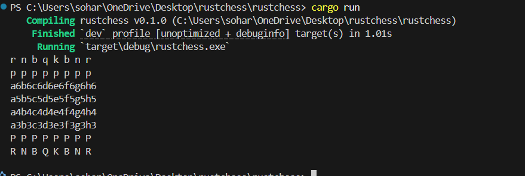
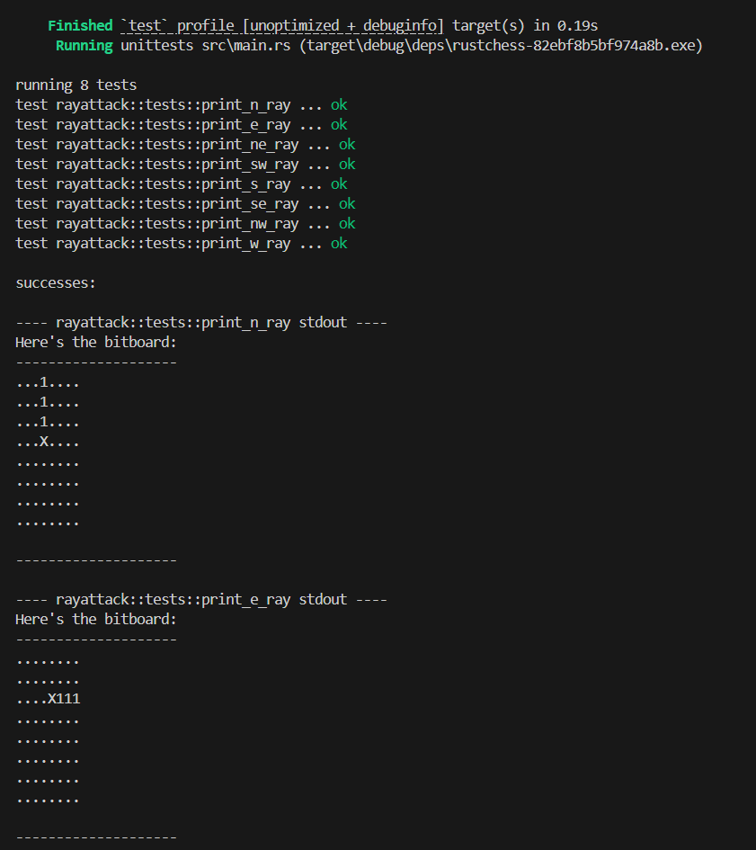
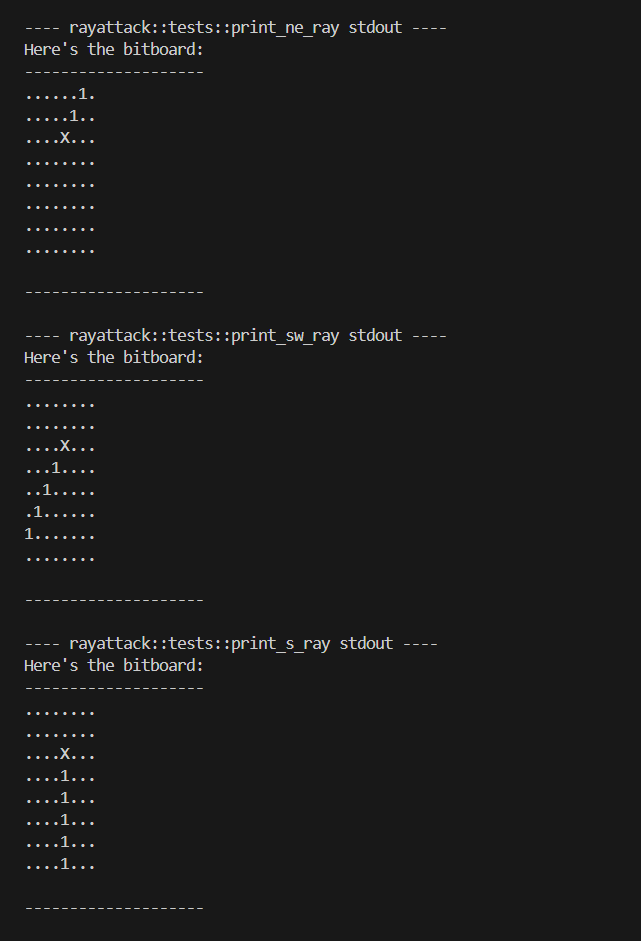
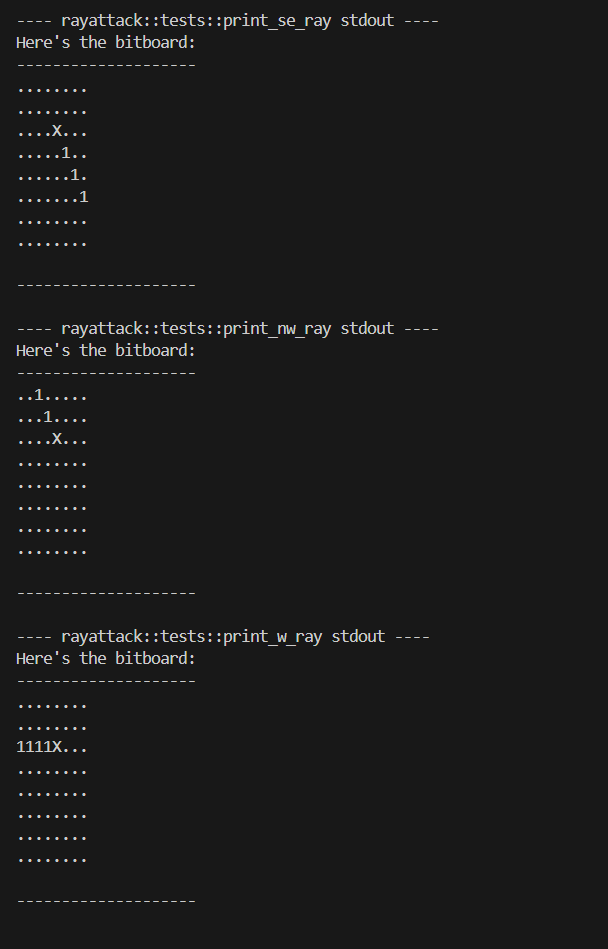
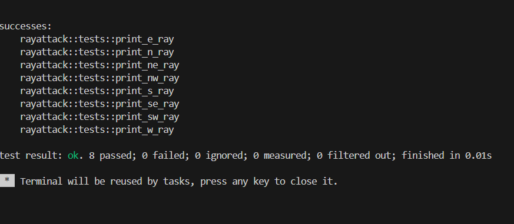

# 🧠 Bitboard-Based Chess in Rust

This project implements a basic chessboard in **Rust** using **bitboards**, enums, and structs. It displays the starting state of a chess game with all pieces properly arranged and outputs the board to the console.

---

## 📁 File Structure

```
src/
├── main.rs
├── game.rs
├── utils.rs
```

---

## 🧱 Core Concepts

### ✅ Bitboard (`u64`)

A **bitboard** is a 64-bit unsigned integer where each bit represents a square on the chessboard.

* Bit `0` → square `a1`
* Bit `1` → square `b1`
* ...
* Bit `63` → square `h8`

This is used to efficiently store and process piece positions.

---

## 🧩 Types and Structs

### `PiecePosition`

```rust
type PiecePosition = u64;
```

Just a type alias to represent bitboards for clarity.

---

### `enum Color`

```rust
enum Color {
    White,
    Black
}
```

Represents the color of a piece.

---

### `enum PieceType`

```rust
enum PieceType {
    Pawn, Rook, Knight, Bishop, Queen, King
}
```

Represents the type of each chess piece.

---

### `struct Piece`

```rust
struct Piece {
    position: PiecePosition,
    color: Color,
    piece_type: PieceType
}
```

Represents a single chess piece with:

* A position (using a bitboard)
* A color (white or black)
* A piece type (pawn, rook, etc.)

---

### `enum Square`

```rust
enum Square {
    Empty,
    Occupied(usize),
}
```

Each square on the board is either:

* `Empty`, or
* `Occupied(index)` → referring to the index of the piece in the `pieces` vector.

---

### `struct Game`

```rust
struct Game {
    pieces: Vec<Piece>,
    squares: Vec<Square>,
}
```

Holds the complete state of the board:

* All pieces (`Vec<Piece>`)
* All 64 squares (`Vec<Square>`)

---

## ♟ Board Initialization

The `initialize()` function sets up the board like a real chess game:

```rust
fn initialize() -> Game
```

It:

* Adds white pieces to the bottom 2 rows (`a1` to `h2`)
* Adds 32 empty squares (`a3` to `h6`)
* Adds black pieces to the top 2 rows (`a7` to `h8`)

Uses `push_piece_and_square` and `push_empty_square` to populate the board.

---

## 📤 Displaying the Board

The `to_string()` method of `Game` generates a **human-readable board**:

```rust
fn to_string(&self) -> String
```

* Iterates over each square
* If the square is empty → shows its name like `a3`
* If occupied → shows the piece (e.g., `P ` or `r `)
* After every 8 squares, it creates a row
* Rows are inserted **from bottom up** (to match chessboard view from white's perspective)

---

### Example Output


---
---

### ATTACK PATTERN





---

## 🛠 Other Important Functions

### `index_to_position(index: usize) -> String`

Converts a square index (0–63) into chess notation:

* `0` → `a1`
* `7` → `h1`
* `8` → `a2`
* ...
* `63` → `h8`

---

### `bit_scan(bit: u64) -> usize`

Efficiently finds the index of the 1-bit in a given bitboard using a modulo lookup trick.

---

### `Piece::to_string()`

Returns a short string like:

* `"P "` for white pawn
* `"k "` for black king
* All white pieces are **uppercase**
* All black pieces are **lowercase**


---
### ♟️ FEN (Forsyth–Edwards Notation) Support

This project includes support for FEN (Forsyth–Edwards Notation), allowing the board state to be serialized and deserialized in a standard format used by most chess engines and GUIs.

The following example is from the FEN specification:[10]
Here is the FEN for the starting position:
```bash
rnbqkbnr/pppppppp/8/8/8/8/PPPPPPPP/RNBQKBNR w KQkq - 0 1
```
And after the move 1.e4:
```bash
rnbqkbnr/pppppppp/8/8/4P3/8/PPPP1PPP/RNBQKBNR b KQkq e3 0 1
```
And then after 1...c5:
```bash
rnbqkbnr/pp1ppppp/8/2p5/4P3/8/PPPP1PPP/RNBQKBNR w KQkq c6 0 2
```
And then after 2.Nf3:
```bash
rnbqkbnr/pp1ppppp/8/2p5/4P3/5N2/PPPP1PPP/RNBQKB1R b KQkq - 1 2
```
```

## ✅ Features:
Parse FEN strings to initialize the game board.

Generate FEN strings from the current game state.

Track and update metadata such as castling rights, en passant targets, halfmove clocks, and fullmove numbers.
```bash
<1> Piece placement
<2> Active color
<3> Castling availability
<4> En passant target square
<5> Halfmove clock
<6> Fullmove number
```
---

## 🚀 How to Run

1. Clone this repo:

```bash
git clone https://github.com/Sohardbegraj/chess.in.git
cd rust-bitboard-chess
```

2. Run the project:

```bash
cargo run
```

You’ll see the board printed in the terminal.

---

## 🧠 Next Steps / Ideas

* Add move generation
* Handle turns (white/black)
* Legal move validation
* GUI or TUI visualization
* Piece capturing and check/checkmate logic

---

